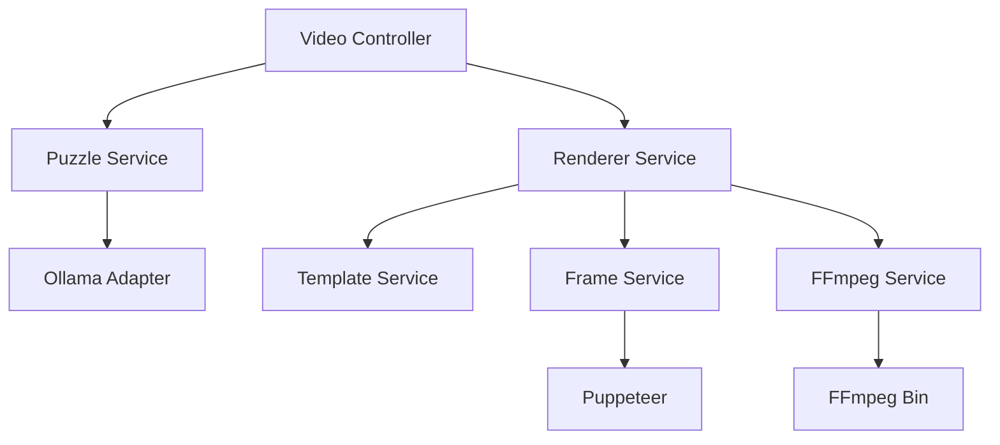

# 🛠️ ShortForge

[](https://nestjs.com/)
[](https://nx.dev/)
[](https://www.typescriptlang.org/)
[](https://opensource.org/licenses/MIT)

**ShortForge** is a high-performance, production-ready SaaS backend designed to automate the generation of vertical coding puzzles. Using a combination of Local LLMs (Ollama), Headless Browsers (Puppeteer), and Media Processing (FFmpeg), it transforms logic puzzles into engaging 1080x1920 video content.

---

## 🚀 Features

- **🤖 AI-Powered Puzzle Generation**: Leverages local Ollama instances (Gemma/Qwen) to generate unique coding puzzles.
- **🖼️ Timeline-Based Rendering**: Automated 12-frame generation including question, countdown timer, and dedicated answer screens.
- **🎬 Professional Video Stitching**: High-fidelity MP4 generation with H.264 encoding optimized for social media (TikTok/Reels/Shorts).
- **🎨 Dynamic Templating**: HTML5/CSS3 templates with glassmorphism aesthetics and responsive typography.
- **🛡️ Production Grade Architecture**: Modular NestJS design with strict Zod validation and safe HTML rendering.
- **⚡ High Performance**: Non-blocking asynchronous rendering pipeline with automatic resource cleanup.

---

## 🛠️ Tech Stack

- **Backend**: [NestJS](https://nestjs.com/) (Modular Architecture)
- **Monorepo Management**: [Nx](https://nx.dev/)
- **AI Runtime**: [Ollama](https://ollama.ai/)
- **Frame Capture**: [Puppeteer](https://pptr.dev/)
- **Media Engine**: [FFmpeg](https://ffmpeg.org/)
- **Validation**: [Zod](https://zod.dev/)
- **Language**: [TypeScript](https://www.typescriptlang.org/) (Strict Mode)

---

## 🏗️ Architecture

The project follows a clean, modular architecture:



---

## 🚦 Getting Started

### Prerequisites

- **Node.js**: v18+
- **pnpm**: v8+
- **Ollama**: Running locally with `gemma` or `qwen` model.
- **FFmpeg**: Installed and available in the system PATH.

### Installation

1. Clone the repository:
   ```bash
   git clone https://github.com/yourusername/short-forge.git
   cd short-forge
   ```

2. Install dependencies:
   ```bash
   pnpm install
   ```

3. Configure environment variables (if any):
   ```bash
   cp .env.example .env
   ```

### Usage

**Start Development Server:**
```bash
pnpm start:dev
```

**Generate a Video:**
```bash
# Example API Call
curl -X POST http://localhost:3000/api/v1/videos/generate
```

---

## 📁 Project Structure

```text
├── apps/
│   └── short-forge/          # Main NestJS application
│       ├── src/app/
│       │   ├── puzzle/       # Puzzle generation logic (AI)
│       │   ├── renderer/     # Media processing & rendering
│       │   └── video/        # API Orchestration
├── templates/                # HTML/CSS templates for frames
└── output/                   # Final generated videos (git-ignored)
```

---

## 🗺️ Roadmap

- [x] Timeline-based rendering (12 frames)
- [x] Dedicated answer screen template
- [ ] Multi-model LLM routing
- [ ] Background queue processing (BullMQ)
- [ ] S3/Cloud Storage integration
- [ ] Automated subtitles/voiceover

---

## 📄 License

Distributed under the MIT License. See `LICENSE` for more information.

---

<p align="center">
  Built with ❤️ by the ShortForge Team
</p>
